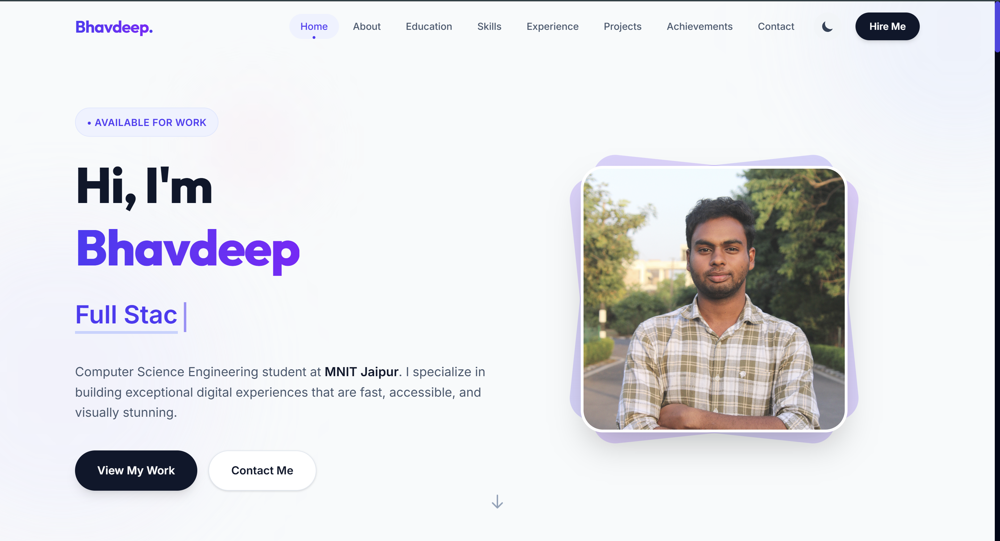
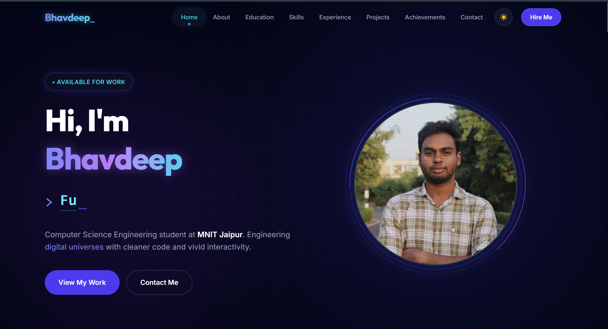

# 🌐 Personal Portfolio Website

A modern, responsive portfolio website built with React.js featuring dark/light theme toggle, smooth animations, and interactive UI components. Showcases my projects, experience, education, and achievements with an integrated email functionality for easy contact.

[](https://bhavdeepmnit.vercel.app/)
[](https://reactjs.org/)
[](https://vitejs.dev/)
[](LICENSE)

## ✨ Features

- 🎨 **Modern UI/UX** - Clean, professional design with smooth animations
- 🌓 **Dark/Light Mode** - Toggle between Multiverse dark theme and light theme with persistent preference
- 📱 **Fully Responsive** - Optimized for all devices (mobile, tablet, desktop)
- 📧 **Contact Form** - Integrated email functionality with Node.js backend
- 🚀 **Fast Performance** - Built with Vite for lightning-fast development and builds
- 🎭 **Interactive Sections** - Smooth scrolling and engaging UI elements
- 📊 **Dynamic Content** - Showcases projects, skills, experience, and achievements

## 🛠️ Tech Stack

### Frontend
- **React.js** - UI library
- **Vite** - Build tool and dev server
- **CSS3** - Styling with modern CSS features
- **React Hooks** - State management

### Backend
- **Node.js** - Runtime environment
- **Express.js** - Web framework
- **Nodemailer** - Email functionality
- **CORS** - Cross-origin resource sharing

## 📂 Project Structure

```
my_portfolio/
├── new_porfolio/              # Frontend application
│   ├── src/
│   │   ├── components/        # React components
│   │   │   ├── AboutSection.jsx
│   │   │   ├── AchievementsSection.jsx
│   │   │   ├── ContactSection.jsx
│   │   │   ├── EducationSection.jsx
│   │   │   ├── ExperienceSection.jsx
│   │   │   ├── Footer.jsx
│   │   │   ├── HeroSection.jsx
│   │   │   ├── Navigation.jsx
│   │   │   ├── ProjectsSection.jsx
│   │   │   └── SkillsSection.jsx
│   │   ├── data/              # Data files
│   │   │   ├── aboutData.js
│   │   │   ├── experiences.js
│   │   │   ├── personalInfo.js
│   │   │   ├── projects.js
│   │   │   └── skills.js
│   │   ├── assets/            # Images and static files
│   │   ├── App.jsx            # Main app component
│   │   ├── main.jsx           # Entry point
│   │   └── index.css          # Global styles
│   ├── public/                # Public assets
│   ├── package.json
│   └── vite.config.js
│
└── backend_portfolio/         # Backend application
    ├── server.js              # Express server
    ├── .env                   # Environment variables
    ├── package.json
    └── README.md              # Backend setup instructions

```

## 🚀 Getting Started

### Prerequisites

- Node.js (v14 or higher)
- npm or yarn
- Gmail account (for email functionality)

### Installation

1. **Clone the repository**
   ```bash
   git clone https://github.com/Bhavdeepmnit/my_portfolio.git
   cd my_portfolio
   ```

2. **Install Frontend Dependencies**
   ```bash
   cd new_porfolio
   npm install
   ```

3. **Install Backend Dependencies**
   ```bash
   cd ../backend_portfolio
   npm install
   ```

4. **Configure Environment Variables**
   
   Create a `.env` file in the `backend_portfolio` directory:
   ```env
   PORT=5000
   EMAIL_USER=your-gmail@gmail.com
   EMAIL_PASS=your-16-char-app-password
   RECIPIENT_EMAIL=where-you-want-to-receive@gmail.com
   ```

   See [backend_portfolio/README.md](backend_portfolio/README.md) for detailed email setup instructions.

### Running the Application

1. **Start the Backend Server**
   ```bash
   cd backend_portfolio
   npm start
   ```
   The backend will run on `http://localhost:5000`

2. **Start the Frontend Development Server**
   ```bash
   cd new_porfolio
   npm run dev
   ```
   The frontend will run on `http://localhost:5173`

3. **Open your browser** and navigate to `http://localhost:5173`

## 📦 Build for Production

### Frontend Build
```bash
cd new_porfolio
npm run build
```
The production build will be in the `dist/` folder.

### Preview Production Build
```bash
npm run preview
```

## 🎯 Sections Overview

### 🏠 Hero Section
- Eye-catching introduction with animated text
- Quick navigation buttons
- Social media links

### 👨‍💻 About Section
- Brief introduction and background
- Personal summary
- Professional highlights

### 🎓 Education Section
- Academic qualifications
- Institutions attended
- Timeline visualization

### 💻 Skills Section
- Technical skills with proficiency levels
- Interactive skill bars
- Organized by categories

### 💼 Experience Section
- Professional experience
- Internships and roles
- Detailed descriptions

### 🚀 Projects Section
- Featured projects with descriptions
- Technologies used
- GitHub and live demo links

### 🏆 Achievements Section
- Competitive programming achievements
- Certifications
- Notable accomplishments

### 📬 Contact Section
- Contact form with validation
- Email integration
- Social media links
- Location information

## 📧 Email Functionality

The contact form is integrated with a Node.js backend using Nodemailer. When visitors submit the form:
- Form data is validated on both client and server
- Email is sent to your configured Gmail account
- Beautiful HTML email template
- Success/error feedback to the user

Refer to [backend_portfolio/README.md](backend_portfolio/README.md) for detailed setup instructions.

## 🎨 Customization

### Updating Personal Information
Edit the files in `new_porfolio/src/data/`:
- `personalInfo.js` - Contact info, social links
- `aboutData.js` - About section content
- `skills.js` - Your skills and proficiency levels
- `experiences.js` - Work experience
- `projects.js` - Your projects

### Changing Theme Colors
Modify the CSS variables in `new_porfolio/src/index.css` and component styles.

### Adding New Sections
Create a new component in `src/components/` and import it in `App.jsx`.

## 🌐 Deployment

### Frontend (Vercel)
1. Push your code to GitHub
2. Import your repository on [Vercel](https://vercel.com)
3. Configure build settings:
   - Framework Preset: Vite
   - Root Directory: `new_porfolio`
   - Build Command: `npm run build`
   - Output Directory: `dist`

### Backend
Deploy the backend on platforms like:
- [Render](https://render.com)
- [Railway](https://railway.app)
- [Heroku](https://heroku.com)

Update the API endpoint in `ContactSection.jsx` to your deployed backend URL.

## 📝 License

This project is open source and available under the [MIT License](LICENSE).

## 🤝 Contributing

Contributions, issues, and feature requests are welcome! Feel free to check the [issues page](https://github.com/Bhavdeepmnit/my_portfolio/issues).

## 👨‍💻 Author

**Bhavdeep**
- Website: [bhavdeepmnit.vercel.app](https://bhavdeepmnit.vercel.app/)
- GitHub: [@Bhavdeepmnit](https://github.com/Bhavdeepmnit)
- LinkedIn: [Bhavdeep Singh](https://www.linkedin.com/in/bhavdeep-singh-00a1b7229/)

## 🙏 Acknowledgments

- Icons from [Heroicons](https://heroicons.com/)
- Fonts from [Google Fonts](https://fonts.google.com/)
- Inspiration from modern portfolio designs

## 📸 Screenshots

### Light Mode


### Dark Mode


---

⭐ If you found this project helpful, please give it a star!

Made with ❤️ by Bhavdeep
